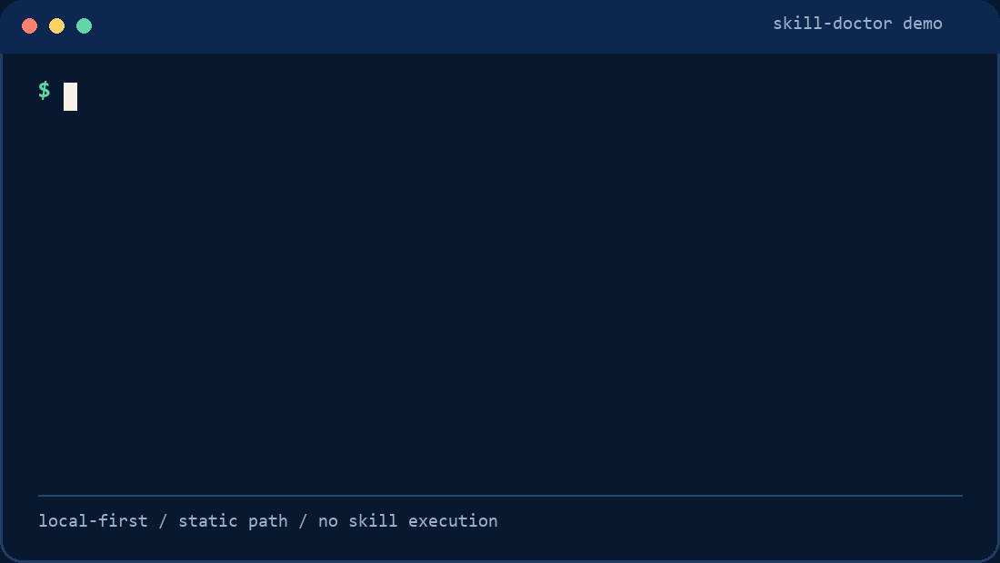
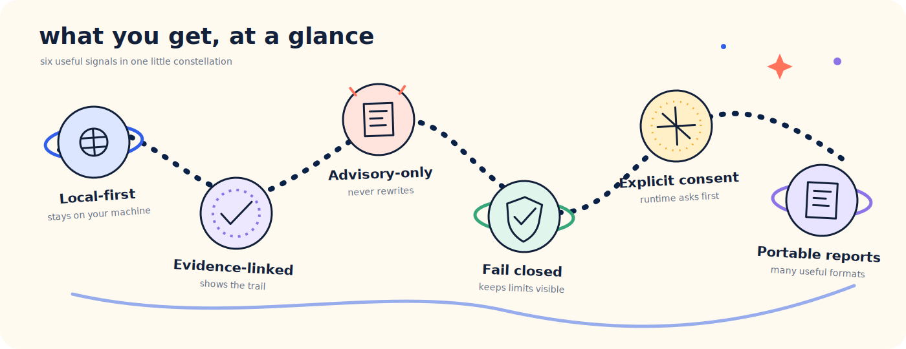
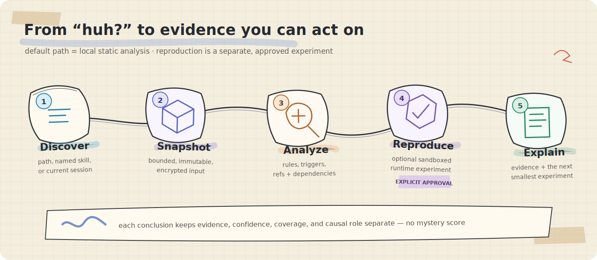
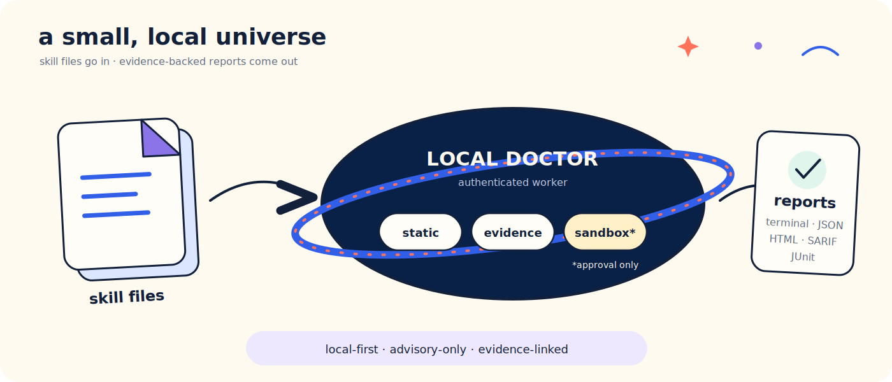

<div align="center">
  
  <h1>Agent Skill Doctor</h1>
  <p><strong>Find broken, risky, and misleading Codex or Claude Code skills locally—without executing or rewriting them.</strong></p>
  <p>
    <a href="https://github.com/awesome-liuxiao/agent-skill-doctor/actions/workflows/ci.yml"></a>
    
    <a href="LICENSE"></a>
    
  </p>
</div>

When a skill fails, the symptom is usually obvious; the cause is not. A trigger may have missed,
a reference may have escaped its boundary, a dependency may be unavailable, or the skill may be
completely unrelated to the failure.

Agent Skill Doctor turns a local skill, a discovered Codex or Claude Code skill, or bounded session
evidence into a cautious diagnosis. It tells you **what it observed**, **which checks actually ran**,
**how strong the evidence is**, and **what to try next**. It does not silently edit the skill, execute
untrusted content during static analysis, or collapse uncertainty into a mystery score.

> [!IMPORTANT]
> This repository is a development preview. The local implementation is broad and heavily tested,
> but stable v1 still requires independent cross-platform, held-out, and design-partner evidence.
> See the [roadmap status](docs/ROADMAP_STATUS.md) for the exact release gates.

## Try it in 60 seconds



The bundled example is deliberately broken. The doctor finds its missing reference and unsafe
command pattern, links both findings to their source lines, and leaves every file untouched.

## What you get



- **Fast static checks by default.** Inspect frontmatter, references, secrets, commands, fallbacks,
  triggers, dependencies, and common script hazards without executing skill content.
- **Platform-aware discovery.** Check an explicit directory, a named Codex or Claude Code skill, or
  every discovered copy while preserving shadowed and inactive entries.
- **Session-focused diagnosis.** Use bounded current-session evidence to rank plausible explanations
  and make missing evidence visible.
- **Controlled runtime experiments.** Plan sandboxed tests first, review the exact scope and estimate,
  then approve an immutable plan token only when you want execution.
- **Honest causal language.** Severity, confidence, coverage, causal role, and result state remain
  separate, so a rule match is not automatically called a root cause.
- **Reports for people and tools.** Get the same stable findings in the terminal, versioned JSON,
  offline HTML, SARIF 2.1.0, and JUnit XML.

## Quick start

### 1. Install the development preview

You need **Python 3.12** and Git. Install the CLI into an isolated environment with either tool:

```console
uv tool install git+https://github.com/awesome-liuxiao/agent-skill-doctor.git@v0.1.0a1
```

```console
pipx install git+https://github.com/awesome-liuxiao/agent-skill-doctor.git@v0.1.0a1
```

This source-preview path is intentionally separate from the signed standalone installer used by
gated releases. See [verified installation](docs/INSTALLATION.md) for the trust boundary.

### 2. Run your first check

```console
# Check one local skill directory
skill-doctor check path/to/skill

# Resolve and check the effective Codex skill named "deploy"
skill-doctor check deploy --platform codex

# Diagnose the current Codex session
skill-doctor diagnose --platform codex
```

To reproduce the demo against the included example:

```console
git clone --branch v0.1.0a1 --depth 1 https://github.com/awesome-liuxiao/agent-skill-doctor.git
skill-doctor check agent-skill-doctor/examples/broken-skill
```

The command starts an authenticated per-user worker on demand, streams durable progress events,
prints a concise conclusion, and writes the full report set under the local state directory.

## How it works



The default path stops after bounded local analysis. If a stronger causal claim needs reproduction,
the doctor proposes the smallest useful experiment instead of quietly running one.

### Common workflows

| Goal | Command |
| --- | --- |
| Check a local skill | `skill-doctor check path/to/skill` |
| Check a named platform skill | `skill-doctor check deploy --platform codex` |
| Inventory and check every discovered copy | `skill-doctor check --all --platform claude --cwd path/to/repo` |
| Diagnose a session transcript | `skill-doctor diagnose --platform claude --transcript path/to/transcript.jsonl` |
| Inspect runtime and sandbox capability | `skill-doctor readiness --deep --json` |
| List or inspect durable jobs | `skill-doctor jobs` / `skill-doctor status JOB_ID --verbose` |
| Emit the versioned machine report | `skill-doctor check path/to/skill --json` |

### Dynamic testing is always two-step

The first command creates a plan; it does **not** start the agent runtime:

```console
skill-doctor check path/to/skill --dynamic --runtime-version "VERSION" --json
```

Review the reported backend, runtime, permissions, evals, estimated cost, and consent scopes. Only
then repeat the unchanged request with its approval token:

```console
skill-doctor check path/to/skill --dynamic --runtime-version "VERSION" \
  --approve-dynamic PLAN_TOKEN --json
```

Any material change produces a different token and blocks execution. If an attested sandbox or
required containment capability is missing, the test fails closed—there is no direct-host fallback.
Read the [dynamic testing contract](docs/DYNAMIC_TESTING.md) and [sandbox contract](docs/SANDBOX.md)
before enabling this path.

## Architecture



The implementation is deliberately layered:

- immutable, content-addressed snapshots preserve exactly what was checked;
- an authenticated local worker owns durable jobs, cancellation, resumption, and caches;
- static, session, dynamic, causal, and performance engines record completed and missing coverage;
- retained raw artifacts use AES-256-GCM, with the master key protected by the host credential store;
- report renderers share stable finding and evidence identifiers across every output format.

Static checks do not follow symlinks, allow referenced paths to escape the skill root, call a model,
or access the network. Hostile and malformed skill content is always treated as data.

## Reports and CI

Every completed diagnosis produces interoperable outputs:

| Output | Best for |
| --- | --- |
| Terminal summary | The conclusion, strongest observations, and next experiment |
| Versioned JSON | Automation and lossless downstream processing |
| Offline HTML | Reviewing evidence, causal edges, and dynamic-trial timelines |
| SARIF 2.1.0 | Code-scanning integrations |
| JUnit XML | CI test-result integrations |

The default exit policy is intentionally small and auditable:

| Exit | Meaning |
| ---: | --- |
| `0` | No unsuppressed high-severity, high-confidence finding |
| `1` | At least one unsuppressed high-severity, high-confidence finding |
| `2` | Analysis incomplete or readiness failed |
| `3` | Internal failure |
| `4` | Cancelled |

A clean exit is not a universal claim that a skill is “safe” or “healthy.” It means the completed
checks did not establish a blocking issue. The report always records skipped, unsupported, and failed
coverage beside that conclusion.

### Use it in GitHub Actions

The repository includes a reusable composite action. During the development preview, pin it to an
exact commit for production use; the preview tag is convenient for evaluation:

```yaml
- uses: awesome-liuxiao/agent-skill-doctor@v0.1.0a1
  with:
    path: path/to/skill
    platform: codex
```

The action exposes the native exit code and writes a SARIF file for optional upload to GitHub code
scanning. See the complete [GitHub Actions integration](docs/INTEGRATIONS.md#github-actions).

## Trust model

Agent Skill Doctor is built around a few non-negotiable boundaries:

- **Evidence before certainty:** every visible finding links to evidence; missing evidence is stated.
- **Diagnosis before remediation:** the tool suggests the smallest next experiment and a remediation
  lead, but never edits the checked skill.
- **Consent before execution or export:** runtime tests and sanitized export use immutable two-step
  previews and approvals.
- **Containment before convenience:** absent credentials, sandboxing, provenance, or verification
  stops the relevant operation rather than weakening it.
- **Local by default:** telemetry is off until explicitly configured, and static analysis requires no
  model or network access.

For the full security boundary, start with the [threat model](docs/THREAT_MODEL.md) and
[security policy](SECURITY.md).

## Project status

Current package version: **`0.1.0a1`** — a static-analysis alpha, not stable v1.

The current local Windows quality gate records **145 passed tests** with 3 symlink tests skipped only
because the host lacks symlink privileges. Ruff and strict mypy checks pass. Checked-in public corpus
results cover static detection, causal classification, containment, fault injection, and functional
flows. These are useful development results—not a substitute for the external evidence required for
stable v1.

## Documentation map

| Area | Start here |
| --- | --- |
| Using the doctor | [Discovery](docs/DISCOVERY.md) · [Session evidence](docs/SESSION_EVIDENCE.md) · [Reporting](docs/REPORTING.md) |
| Runtime and safety | [Dynamic testing](docs/DYNAMIC_TESTING.md) · [Sandbox](docs/SANDBOX.md) · [Threat model](docs/THREAT_MODEL.md) |
| Installation and updates | [Verified installation](docs/INSTALLATION.md) · [Reproducible builds](docs/REPRODUCIBLE_BUILDS.md) |
| Integrations and community | [GitHub Action and wrappers](docs/INTEGRATIONS.md) · [Design partners](docs/DESIGN_PARTNERS.md) · [Contributing](CONTRIBUTING.md) |
| Technical introduction | [Why agent skills fail in surprising ways](docs/WHY_AGENT_SKILLS_FAIL.md) |
| Diagnosis model | [Product boundaries](docs/PRODUCT.md) · [Claim model](docs/DIAGNOSTIC_MODEL.md) · [Policies](docs/POLICIES.md) |
| Performance and compatibility | [Performance](docs/PERFORMANCE.md) · [Compatibility](docs/COMPATIBILITY.md) |
| Release evidence | [Roadmap status](docs/ROADMAP_STATUS.md) · [Public benchmark snapshot](docs/STATE_OF_AGENT_SKILLS.md) · [Release process](docs/RELEASE_PROCESS.md) |

## Development

With the development environment active:

```console
python -m ruff format --check .
python -m ruff check .
python -m mypy
python -m pytest
```

The repository includes public fixtures, functional scenarios, causal scenarios, fault injection,
release checks, JSON schemas, and thin explicit-invocation wrappers for Codex and Claude Code.

## Join the preview

The project is looking for maintainers of real Codex and Claude Code skills who can share
sanitized outcomes from local static checks. Raw prompts, credentials, private paths, and customer
skills are not requested. Start with [GitHub Discussions](https://github.com/awesome-liuxiao/agent-skill-doctor/discussions),
read the [design-partner guide](docs/DESIGN_PARTNERS.md), or pick a scoped contribution from
[the contributing guide](CONTRIBUTING.md).

## Security and license

Please report vulnerabilities through the private process in [SECURITY.md](SECURITY.md), not through
a public issue.

Agent Skill Doctor is licensed under the [Apache License 2.0](LICENSE).
